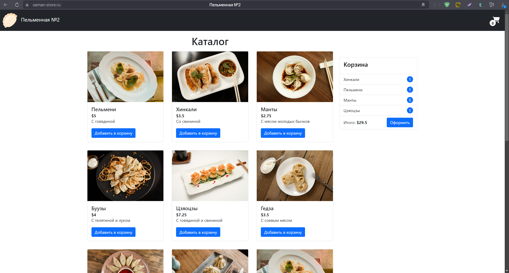
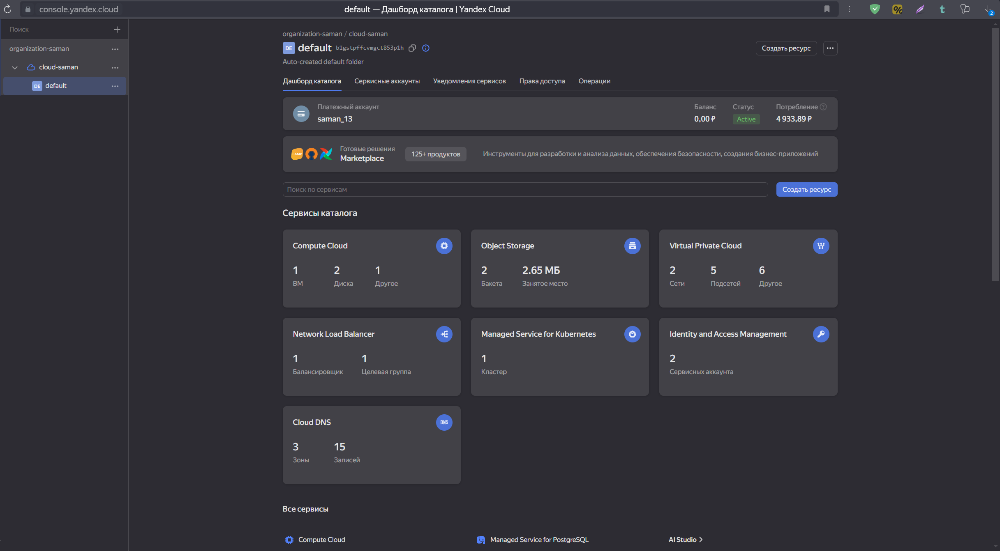
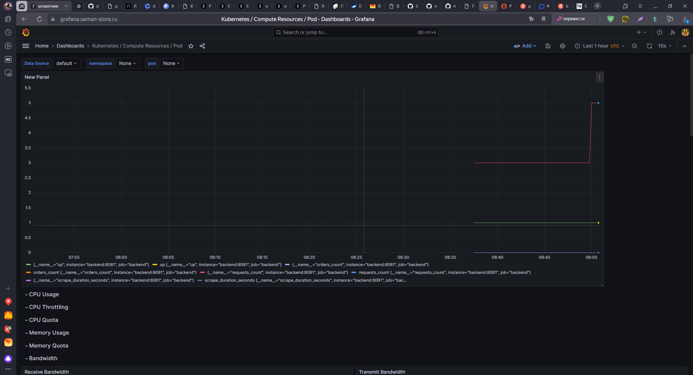

## Описание проекта
Репозиторий содержит код, который позволяет развернуть в облаке Yandex.Cloude учебный проект "Пельменная". 
Интернет-магазин "Пельменная" состоит из бэкенда и фронтенда.

## Структура проекта
- директория "terraform" содержит код, позволяющий развернуть кластер Kubernetes и другие ресурсы в облаке Yandex.Cloude;
- директория "backend" содержит исходный код бэкэнда на языке Go и Dockerfile, описывает процесс многоэтапной сборки бэкэнда в Docker образ;
- директория "frontend" содержит исходный код фронтэнда на языке HTML и JS, а так же Dockerfile описывает процесс многоэтапной сборки фронтэнда в Docker образ;
- директория "kubernetes" содержит kubernetes-манифесты для публикации приложения (frontend и backend) в кластере Kubernetes;
- директоря "helm" содержит helm-чарты для запуска приложений внутри кластера Kubernetes.

## Создание инфраструктуры в облаке Yandex.Cloude
### Установка кластера
1) Создать сервисный аккаунт с ролью editor
2) Получить статический ключ доступа (access_key и secret_key) см. [инструкцию](https://yandex.cloud/ru/docs/tutorials/infrastructure-management/terraform-state-storage#create-service-account)

Для генерации ключей:
```
yc iam access-key create \
  --service-account-id <идентификатор_сервисного_аккаунта>
```
Если нужно сгенерировать ключ повторно
Если вы забыли ACCESS_KEY или SECRET_KEY, создайте новый с помощью той же команды yc iam access-key create. Старые ключи можно удалить при необходимости:

```
yc iam access-key list --service-account-id <идентификатор_сервисного_аккаунта>
yc iam access-key deactivate <идентификатор_ключа>
yc iam access-key delete <идентификатор_ключа>
```
3) Создать бакет с ограниченным доступом для хранения состояния terraform.
4) Присвоить значения переменным в файле backend.tf
```
endpoint = "storage.yandexcloud.net"
bucket = "<имя_файла_состояния>"
region = "ru-central1"
key = "<путь_к_файлу_состояния_в_бакете>/<имя_файла_состояния>.tfstate"
access_key = "<идентификатор_ключа>"
secret_key = "секретный_ключ" 
skip_region_validation = true
skip_credentials_validation = true
```
5) Присвоить значения переменным в файле terraform.tfvars
```
cloud_id = "<идентификатор_облака>"
folder_id = "<идентификатор_каталога>"
token = "<IAM-_или_OAuth-токен>"
zone_name = "<название зоны>"
domain = "<домен_приложения>"
```
6) Последовательно выполнить команды
```
terraform init
terraform plan
terraform apply
```

### S3
Проверить, что состояние Terraform'а хранится в в S3.
Поместите картинки, которые использует сайт, в созданный бакет S3.


### Подключение к кластеру
Создайте статический файл конфигурации для доступа к кластеру Kubernetes.

Получите список кластеров, проверьте его ID:
```
yc managed-kubernetes cluster list
```
Создайте статический kubeconfig
Для создания файла подключения выполните команду:
```
yc managed-kubernetes cluster get-credentials <CLUSTER_NAME> --external --force
```
`<CLUSTER_NAME>` — имя вашего кластера.

Флаг `--external` настраивает подключение к кластеру с внешним доступом.

Флаг `--force` перезаписывает существующий файл конфигурации.
Эта команда создаст или обновит файл ~/.kube/config с данными для подключения.**

Проверьте подключение.
Убедитесь, что подключение к кластеру работает:
```
kubectl cluster-info
```

Для подключения к кластеру используя iam токен необходимо выполнить команду:
```
yc iam create-token
```
Затем скопировать токен в kube config в раздел token:
Внимание! Токен действителен в течение 12 часов.

Либо чтобы получить статический kubeconfig, который не требует использования команды yc для получения токена, вы можете воспользоваться сервисным аккаунтом для аутентификации. Для этого нужно сделать следующие шаги:

**a) Создание сервисного аккаунта в Яндекс Облаке**
1. В консоли Яндекс Облака создайте Сервисный аккаунт с правами доступа к Kubernetes.
2. Скачайте JSON-ключ для этого сервисного аккаунта.

**b)** Получение kubeconfig с использованием сервисного аккаунта
Используйте следующий подход для получения конфигурации Kubernetes:

1. Настройте переменную окружения для аутентификации с использованием ключа сервисного аккаунта:

В командной строке (на локальной машине) выполните команду:

```bash
export YC_SERVICE_ACCOUNT_KEY=<path_to_service_account_key>.json
```
2. Получите kubeconfig, используя сервисный аккаунт:

Вы можете использовать следующую команду для получения kubeconfig:

```bash
yc iam key create --service-account <service_account_id> --output <path_to_key>.json
yc managed-kubernetes cluster get-credentials <cluster-name> --kubeconfig <path_to_new_kubeconfig>
````
Это создаст новый kubeconfig с нужной аутентификацией через сервисный аккаунт.

**c) Использование нового kubeconfig**

Теперь ваш kubeconfig файл будет использовать токены от сервисного аккаунта, и вам не нужно будет генерировать новые токены вручную каждые 12 часов.


### Настройка единой точки входа трафика в кластер Kubernetes
Установите Ingress-контроллер NGINX
```
helm repo add ingress-nginx https://kubernetes.github.io/ingress-nginx 
helm repo update
helm install ingress-nginx ingress-nginx/ingress-nginx
```
Узнайте внешний ip-адрес ingress-контроллера(EXTERNAL-IP)
```
kubectl get svc
```
В сервисе Cloud DNS выберите зону соответствующую вашему домену и установите значение записи типа А равное внешнему ip-адресу ingress-контроллера.

### Установка сертификата
Установите менеджер сертификатов
```
kubectl apply -f https://github.com/jetstack/cert-manager/releases/download/v1.13.1/cert-manager.yaml
```
Убедитесь, что в пространстве имен cert-manager создано три пода с готовностью 1/1 и статусом Running:
```
kubectl get pods -n cert-manager --watch
```

### Доменное имя
Зарегистрируйте домен для интернет-магазина.
Для этого укажите адреса серверов имен Yandex Cloud в NS-записях вашего регистратора:
- ns1.yandexcloud.net
- ns2.yandexcloud.net

## Публикация приложения
Публиковать приложение можно двумя способами:
- Использовать Kubernetes-манифесты, выполнив команды
```
kubectl apply -f K8s/backend
kubectl apply -f K8s/frontend
```
- Использовать практику CI/CD

## Автоматический процесс интеграции и поставки
В корневой директории проекта находится файл .gitlab-ci.yml, который отслеживает директории backend и frontend и в случае изменения запускает процесс CI/CD, описанный в файле .gitlab-ci.yml соответствующей директории.
Процесс CI/CD состоит из следующих этапов:
1) Сборка приложения и упаковка его в Docker-образ (используется мультистейдж docker-файл);
2) Тестирование
3) Полученный образ версионируется и помещается в Container Registry gitlab;
4) Формируется helm-чарт приложения новой версия, который загружается в helm-репозиторий Nexus;
5) Выполняется установка(обновление) приложения, используя новый helm-чарта. 


## Мониторинг
Для отслеживания состояния приложения установлены Prometheus, Grafana и Loki.
### Установка Prometheuse
```
helm upgrade --install --atomic prometheus helm/prometheus
```

### Установка Grafana
```
helm upgrade --install --atomic grafana helm/grafana
```

### Установка Loki
```
helm repo add grafana https://grafana.github.io/helm-charts
helm repo update
helm install --atomic loki grafana/loki-stack
```

